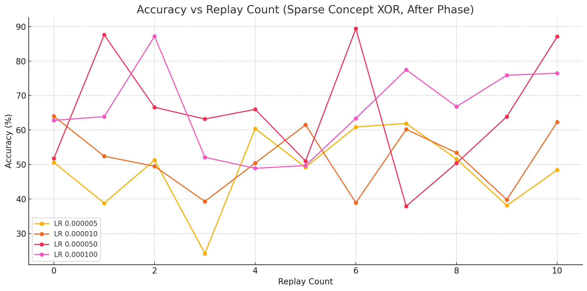

# Adversarial Replay Benchmark

This document presents the results of the Adversarial Replay Benchmark, evaluating performance across different tasks with varying replay counts. The metrics include ADHD scores and accuracy percentages (Acc%).

## Benchmark Results

| Task               | Replays | ADHD  | Acc%  |
| ------------------ | ------- | ----- | ----- |
| Fuzzy XOR Grid     | 0       | 54.00 | 54.00 |
| Fuzzy XOR Grid     | 1       | 55.30 | 55.30 |
| Fuzzy XOR Grid     | 2       | 56.20 | 56.20 |
| Fuzzy XOR Grid     | 3       | 54.30 | 54.30 |
| Global Center Mass | 0       | 80.70 | 80.70 |
| Global Center Mass | 1       | 83.30 | 83.30 |
| Global Center Mass | 2       | 81.40 | 81.40 |
| Global Center Mass | 3       | 83.60 | 83.60 |
| Hotspot + Noise    | 0       | 78.90 | 78.90 |
| Hotspot + Noise    | 1       | 83.20 | 83.20 |
| Hotspot + Noise    | 2       | 86.70 | 86.70 |
| Hotspot + Noise    | 3       | 81.10 | 81.10 |

# Extended Multi-Task Deep Replay Sweep

This document presents the results of the Extended Multi-Task Deep Replay Sweep for the Noisy Ring Detection task, evaluated with a 5-layer model across different phases ("before" and "after") and varying repeat counts. The metrics include ADHD scores and accuracy percentages (Acc%).

## Benchmark Results

| Task                 | Layers   | Phase  | Repeats | ADHD  | Acc%  |
| -------------------- | -------- | ------ | ------- | ----- | ----- |
| Noisy Ring Detection | 5 layers | after  | 0       | 94.50 | 94.50 |
| Noisy Ring Detection | 5 layers | after  | 0       | 94.90 | 94.90 |
| Noisy Ring Detection | 5 layers | after  | 0       | 95.50 | 95.50 |
| Noisy Ring Detection | 5 layers | after  | 1       | 96.20 | 96.20 |
| Noisy Ring Detection | 5 layers | after  | 1       | 95.10 | 95.10 |
| Noisy Ring Detection | 5 layers | after  | 1       | 94.30 | 94.30 |
| Noisy Ring Detection | 5 layers | after  | 2       | 94.70 | 94.70 |
| Noisy Ring Detection | 5 layers | after  | 2       | 94.90 | 94.90 |
| Noisy Ring Detection | 5 layers | after  | 2       | 94.70 | 94.70 |
| Noisy Ring Detection | 5 layers | after  | 3       | 94.00 | 94.00 |
| Noisy Ring Detection | 5 layers | after  | 3       | 96.00 | 96.00 |
| Noisy Ring Detection | 5 layers | after  | 3       | 96.00 | 96.00 |
| Noisy Ring Detection | 5 layers | after  | 4       | 95.50 | 95.50 |
| Noisy Ring Detection | 5 layers | after  | 4       | 95.00 | 95.00 |
| Noisy Ring Detection | 5 layers | after  | 4       | 95.00 | 95.00 |
| Noisy Ring Detection | 5 layers | after  | 5       | 94.40 | 94.40 |
| Noisy Ring Detection | 5 layers | after  | 5       | 95.30 | 95.30 |
| Noisy Ring Detection | 5 layers | after  | 5       | 95.10 | 95.10 |
| Noisy Ring Detection | 5 layers | after  | 6       | 94.30 | 94.30 |
| Noisy Ring Detection | 5 layers | after  | 6       | 94.40 | 94.40 |
| Noisy Ring Detection | 5 layers | after  | 6       | 95.60 | 95.60 |
| Noisy Ring Detection | 5 layers | after  | 7       | 94.80 | 94.80 |
| Noisy Ring Detection | 5 layers | after  | 7       | 94.90 | 94.90 |
| Noisy Ring Detection | 5 layers | after  | 7       | 95.60 | 95.60 |
| Noisy Ring Detection | 5 layers | after  | 8       | 95.60 | 95.60 |
| Noisy Ring Detection | 5 layers | after  | 8       | 94.60 | 94.60 |
| Noisy Ring Detection | 5 layers | after  | 8       | 95.70 | 95.70 |
| Noisy Ring Detection | 5 layers | after  | 9       | 95.80 | 95.80 |
| Noisy Ring Detection | 5 layers | after  | 9       | 95.60 | 95.60 |
| Noisy Ring Detection | 5 layers | after  | 9       | 94.80 | 94.80 |
| Noisy Ring Detection | 5 layers | after  | 10      | 95.30 | 95.30 |
| Noisy Ring Detection | 5 layers | after  | 10      | 95.60 | 95.60 |
| Noisy Ring Detection | 5 layers | after  | 10      | 95.40 | 95.40 |
| Noisy Ring Detection | 5 layers | before | 0       | 94.90 | 94.90 |
| Noisy Ring Detection | 5 layers | before | 0       | 93.70 | 93.70 |
| Noisy Ring Detection | 5 layers | before | 0       | 94.30 | 94.30 |
| Noisy Ring Detection | 5 layers | before | 1       | 95.10 | 95.10 |
| Noisy Ring Detection | 5 layers | before | 1       | 95.10 | 95.10 |
| Noisy Ring Detection | 5 layers | before | 1       | 96.70 | 96.70 |
| Noisy Ring Detection | 5 layers | before | 2       | 95.30 | 95.30 |
| Noisy Ring Detection | 5 layers | before | 2       | 95.20 | 95.20 |
| Noisy Ring Detection | 5 layers | before | 2       | 95.50 | 95.50 |
| Noisy Ring Detection | 5 layers | before | 3       | 95.40 | 95.40 |
| Noisy Ring Detection | 5 layers | before | 3       | 94.20 | 94.20 |
| Noisy Ring Detection | 5 layers | before | 3       | 94.40 | 94.40 |
| Noisy Ring Detection | 5 layers | before | 4       | 95.40 | 95.40 |
| Noisy Ring Detection | 5 layers | before | 4       | 95.10 | 95.10 |
| Noisy Ring Detection | 5 layers | before | 4       | 94.80 | 94.80 |
| Noisy Ring Detection | 5 layers | before | 5       | 95.40 | 95.40 |
| Noisy Ring Detection | 5 layers | before | 5       | 94.60 | 94.60 |
| Noisy Ring Detection | 5 layers | before | 5       | 93.40 | 93.40 |
| Noisy Ring Detection | 5 layers | before | 6       | 95.50 | 95.50 |
| Noisy Ring Detection | 5 layers | before | 6       | 95.10 | 95.10 |
| Noisy Ring Detection | 5 layers | before | 6       | 94.60 | 94.60 |
| Noisy Ring Detection | 5 layers | before | 7       | 94.50 | 94.50 |
| Noisy Ring Detection | 5 layers | before | 7       | 94.90 | 94.90 |
| Noisy Ring Detection | 5 layers | before | 7       | 94.90 | 94.90 |
| Noisy Ring Detection | 5 layers | before | 8       | 95.60 | 95.60 |
| Noisy Ring Detection | 5 layers | before | 8       | 95.10 | 95.10 |
| Noisy Ring Detection | 5 layers | before | 8       | 95.20 | 95.20 |
| Noisy Ring Detection | 5 layers | before | 9       | 94.10 | 94.10 |
| Noisy Ring Detection | 5 layers | before | 9       | 94.80 | 94.80 |
| Noisy Ring Detection | 5 layers | before | 9       | 95.00 | 95.00 |
| Noisy Ring Detection | 5 layers | before | 10      | 93.90 | 93.90 |
| Noisy Ring Detection | 5 layers | before | 10      | 95.40 | 95.40 |
| Noisy Ring Detection | 5 layers | before | 10      | 95.30 | 95.30 |

# Extended Multi-Task Hard Replay Sweep

This document presents the results of the Extended Multi-Task Hard Replay Sweep for the Sparse Concept XOR and Temporal Echo Classification tasks, evaluated with a 5-layer model across different phases ("before" and "after"), learning rates (LR), and varying repeat counts. The metrics include ADHD scores and accuracy percentages (Acc%).

## Benchmark Results

## Sparse Concept XOR Accuracy Trends

| Task                         | Layers   | Phase  | LR       | Repeats                                                       | ADHD   | Acc%   |
| ---------------------------- | -------- | ------ | -------- | ------------------------------------------------------------- | ------ | ------ |
| Sparse Concept XOR           | 5 layers | after  | 0.000005 | 0                                                             | 50.60  | 50.60  |
| Sparse Concept XOR           | 5 layers | after  | 0.000005 | 1                                                             | 38.80  | 38.80  |
| Sparse Concept XOR           | 5 layers | after  | 0.000005 | 2                                                             | 51.30  | 51.30  |
| Sparse Concept XOR           | 5 layers | after  | 0.000005 | 3                                                             | 24.20  | 24.20  |
| Sparse Concept XOR           | 5 layers | after  | 0.000005 | 4                                                             | 60.40  | 60.40  |
| Sparse Concept XOR           | 5 layers | after  | 0.000005 | 5                                                             | 49.20  | 49.20  |
| Sparse Concept XOR           | 5 layers | after  | 0.000005 | 6                                                             | 60.90  | 60.90  |
| Sparse Concept XOR           | 5 layers | after  | 0.000005 | 7                                                             | 61.90  | 61.90  |
| Sparse Concept XOR           | 5 layers | after  | 0.000005 | 8                                                             | 51.60  | 51.60  |
| Sparse Concept XOR           | 5 layers | after  | 0.000005 | 9                                                             | 38.10  | 38.10  |
| Sparse Concept XOR           | 5 layers | after  | 0.000005 | 10                                                            | 48.40  | 48.40  |
| Sparse Concept XOR           | 5 layers | after  | 0.000010 | 0                                                             | 64.00  | 64.00  |
| Sparse Concept XOR           | 5 layers | after  | 0.000010 | 1                                                             | 52.40  | 52.40  |
| Sparse Concept XOR           | 5 layers | after  | 0.000010 | 2                                                             | 49.50  | 49.50  |
| Sparse Concept XOR           | 5 layers | after  | 0.000010 | 3                                                             | 39.30  | 39.30  |
| Sparse Concept XOR           | 5 layers | after  | 0.000010 | 4                                                             | 50.40  | 50.40  |
| Sparse Concept XOR           | 5 layers | after  | 0.000010 | 5                                                             | 61.50  | 61.50  |
| Sparse Concept XOR           | 5 layers | after  | 0.000010 | 6                                                             | 38.90  | 38.90  |
| Sparse Concept XOR           | 5 layers | after  | 0.000010 | 7                                                             | 60.20  | 60.20  |
| Sparse Concept XOR           | 5 layers | after  | 0.000010 | 8                                                             | 53.40  | 53.40  |
| Sparse Concept XOR           | 5 layers | after  | 0.000010 | 9                                                             | 39.80  | 39.80  |
| Sparse Concept XOR           | 5 layers | after  | 0.000010 | 10                                                            | 62.30  | 62.30  |
| Sparse Concept XOR           | 5 layers | after  | 0.000050 | 0                                                             | 51.80  | 51.80  |
| Sparse Concept XOR           | 5 layers | after  | 0.000050 | 1                                                             | 87.60  | 87.60  |
| Sparse Concept XOR           | 5 layers | after  | 0.000050 | 2                                                             | 66.60  | 66.60  |
| Sparse Concept XOR           | 5 layers | after  | 0.000050 | 3                                                             | 63.20  | 63.20  |
| Sparse Concept XOR           | 5 layers | after  | 0.000050 | 4                                                             | 66.00  | 66.00  |
| Sparse Concept XOR           | 5 layers | after  | 0.000050 | 5                                                             | 51.00  | 51.00  |
| Sparse Concept XOR           | 5 layers | after  | 0.000050 | 6                                                             | 89.40  | 89.40  |
| Sparse Concept XOR           | 5 layers | after  | 0.000050 | 7                                                             | 37.90  | 37.90  |
| Sparse Concept XOR           | 5 layers | after  | 0.000050 | 8                                                             | 50.40  | 50.40  |
| Sparse Concept XOR           | 5 layers | after  | 0.000050 | 9                                                             | 63.90  | 63.90  |
| Sparse Concept XOR           | 5 layers | after  | 0.000050 | 10                                                            | 87.10  | 87.10  |
| Sparse Concept XOR           | 5 layers | after  | 0.000100 | 0                                                             | 62.80  | 62.80  |
| Sparse Concept XOR           | 5 layers | after  | 0.000100 | 1                                                             | 63.90  | 63.90  |
| Sparse Concept XOR           | 5 layers | after  | 0.000100 | 2                                                             | 87.20  | 87.20  |
| Sparse Concept XOR           | 5 layers | after  | 0.000100 | 3                                                             | 52.10  | 52.10  |
| Sparse Concept XOR           | 5 layers | after  | 0.000100 | 4                                                             | 48.90  | 48.90  |
| Sparse Concept XOR           | 5 layers | after  | 0.000100 | 5                                                             | 49.70  | 49.70  |
| Sparse Concept XOR           | 5 layers | after  | 0.000100 | 6                                                             | 63.40  | 63.40  |
| Sparse Concept XOR           | 5 layers | after  | 0.000100 | 7                                                             | 77.50  | 77.50  |
| Sparse Concept XOR           | 5 layers | after  | 0.000100 | 8                                                             | 66.80  | 66.80  |
| Sparse Concept XOR           | 5 layers | after  | 0.000100 | 9                                                             | 75.90  | 75.90  |
| Sparse Concept XOR           | 5 layers | after  | 0.000100 | 10                                                            | 76.50  | 76.50  |
| Sparse Concept XOR           | 5 layers | before | 0.000005 | 0                                                             | 63.70  | 63.70  |
| Sparse Concept XOR           | 5 layers | before | 0.000005 | 1                                                             | 36.80  | 36.80  |
| Sparse Concept XOR           | 5 layers | before | 0.000005 | 2                                                             | 35.70  | 35.70  |
| Sparse Concept XOR           | 5 layers | before | 0.000005 | 3                                                             | 62.80  | 62.80  |
| Sparse Concept XOR           | 5 layers | before | 0.000005 | 4                                                             | 63.20  | 63.20  |
| Sparse Concept XOR           | 5 layers | before | 0.000005 | 5                                                             | 49.10  | 49.10  |
| Sparse Concept XOR           | 5 layers | before | 0.000005 | 6                                                             | 61.40  | 61.40  |
| Sparse Concept XOR           | 5 layers | before | 0.000005 | 7                                                             | 35.80  | 35.80  |
| Sparse Concept XOR           | 5 layers | before | 0.000005 | 8                                                             | 53.60  | 53.60  |
| Sparse Concept XOR           | 5 layers | before | 0.000005 | 9                                                             | 49.50  | 49.50  |
| Sparse Concept XOR           | 5 layers | before | 0.000005 | 10                                                            | 50.40  | 50.40  |
| Sparse Concept XOR           | 5 layers | before | 0.000010 | 0                                                             | 39.10  | 39.10  |
| Sparse Concept XOR           | 5 layers | before | 0.000010 | 1                                                             | 35.60  | 35.60  |
| Sparse Concept XOR           | 5 layers | before | 0.000010 | 2                                                             | 74.90  | 74.90  |
| Sparse Concept XOR           | 5 layers | before | 0.000010 | 3                                                             | 36.30  | 36.30  |
| Sparse Concept XOR           | 5 layers | before | 0.000010 | 4                                                             | 50.70  | 50.70  |
| Sparse Concept XOR           | 5 layers | before | 0.000010 | 5                                                             | 47.30  | 47.30  |
| Sparse Concept XOR           | 5 layers | before | 0.000010 | 6                                                             | 75.90  | 75.90  |
| Sparse Concept XOR           | 5 layers | before | 0.000010 | 7                                                             | 64.90  | 64.90  |
| Sparse Concept XOR           | 5 layers | before | 0.000010 | 8                                                             | 75.30  | 75.30  |
| Sparse Concept XOR           | 5 layers | before | 0.000010 | 9                                                             | 62.20  | 62.20  |
| Sparse Concept XOR           | 5 layers | before | 0.000010 | 10                                                            | 64.20  | 64.20  |
| Sparse Concept XOR           | 5 layers | before | 0.000050 | 0                                                             | 77.30  | 77.30  |
| Sparse Concept XOR           | 5 layers | before | 0.000050 | 1                                                             | 50.30  | 50.30  |
| Sparse Concept XOR           | 5 layers | before | 0.000050 | 2                                                             | 51.10  | 51.10  |
| Sparse Concept XOR           | 5 layers | before | 0.000050 | 3                                                             | 50.30  | 50.30  |
| Sparse Concept XOR           | 5 layers | before | 0.000050 | 4                                                             | 64.50  | 64.50  |
| Sparse Concept XOR           | 5 layers | before | 0.000050 | 5                                                             | 65.50  | 65.50  |
| Sparse Concept XOR           | 5 layers | before | 0.000050 | 6                                                             | 62.80  | 62.80  |
| Sparse Concept XOR           | 5 layers | before | 0.000050 | 7                                                             | 61.10  | 61.10  |
| Sparse Concept XOR           | 5 layers | before | 0.000050 | 8                                                             | 63.30  | 63.30  |
| Sparse Concept XOR           | 5 layers | before | 0.000050 | 9                                                             | 77.70  | 77.70  |
| Sparse Concept XOR           | 5 layers | before | 0.000050 | 10                                                            | 50.20  | 50.20  |
| Sparse Concept XOR           | 5 layers | before | 0.000100 | 0                                                             | 51.10  | 51.10  |
| Sparse Concept XOR           | 5 layers | before | 0.000100 | 1                                                             | 62.90  | 62.90  |
| Sparse Concept XOR           | 5 layers | before | 0.000100 | 2                                                             | 64.90  | 64.90  |
| Sparse Concept XOR           | 5 layers | before | 0.000100 | 3                                                             | 62.40  | 62.40  |
| Sparse Concept XOR           | 5 layers | before | 0.000100 | 4                                                             | 49.00  | 49.00  |
| Sparse Concept XOR           | 5 layers | before | 0.000100 | 5                                                             | 88.10  | 88.10  |
| Sparse Concept XOR           | 5 layers | before | 0.000100 | 6                                                             | 50.60  | 50.60  |
| Sparse Concept XOR           | 5 layers | before | 0.000100 | 7                                                             | 63.30  | 63.30  |
| Sparse Concept XOR           | 5 layers | before | 0.000100 | 8                                                             | 53.40  | 53.40  |
| Sparse Concept XOR           | 5 layers | before | 0.000100 | 9                                                             | 50.30  | 50.30  |
| Sparse Concept XOR           | 5 layers | before | 0.000100 | 10                                                            | 36.90  | 36.90  |
| Temporal Echo Classification | 5 layers | after  | 0.000005 | 0                                                             | 25.40  | 25.40  |
| Temporal Echo Classification | 5 layers | after  | 0.000005 | 1                                                             | 64.00  | 64.00  |
| Temporal Echo Classification | 5 layers | after  | 0.000005 | 2                                                             | 80.00  | 80.00  |
| Temporal Echo Classification | 5 layers | after  | 0.000005 | 3                                                             | 41.30  | 41.30  |
| Temporal Echo Classification | 5 layers | after  | 0.000005 | 4                                                             | 70.60  | 70.60  |
| Temporal Echo Classification | 5 layers | after  | 0.000005 | 5                                                             | 74.20  | 74.20  |
| Temporal Echo Classification | 5 layers | after  | 0.000005 | 6                                                             | 54.50  | 54.50  |
| Temporal Echo Classification | 5 layers | after  | 0.000005 | 7                                                             | 47.60  | 47.60  |
| Temporal Echo Classification | 5 layers | after  | 0.000005 | 8                                                             | 75.70  | 75.70  |
| Temporal Echo Classification | 5 layers | after  | 0.000005 | 9                                                             | 75.60  | 75.60  |
| Temporal Echo Classification | 5 layers | after  | 0.000005 | 10                                                            | 89.40  | 89.40  |
| Temporal Echo Classification | 5 layers | after  | 0.000010 | 0                                                             | 60.00  | 60.00  |
| Temporal Echo Classification | 5 layers | after  | 0.000010 | 1                                                             | 42.00  | 42.00  |
| Temporal Echo Classification | 5 layers | after  | 0.000010 | 2                                                             | 88.60  | 88.60  |
| Temporal Echo Classification | 5 layers | after  | 0.000010 | 3                                                             | 79.60  | 79.60  |
| Temporal Echo Classification | 5 layers | after  | 0.000010 | 4                                                             | 71.80  | 71.80  |
| Temporal Echo Classification | 5 layers | after  | 0.000010 | 5                                                             | 68.30  | 68.30  |
| Temporal Echo Classification | 5 layers | after  | 0.000010 | 6                                                             | 99.10  | 99.10  |
| Temporal Echo Classification | 5 layers | after  | 0.000010 | 7                                                             | 89.00  | 89.00  |
| Temporal Echo Classification | 5 layers | after  | 0.000010 | 8                                                             | 68.10  | 68.10  |
| Temporal Echo Classification | 5 layers | after  | 0.000010 | 9                                                             | 83.40  | 83.40  |
| Temporal Echo Classification | 5 layers | after  | 0.000010 | 10                                                            | 57.60  | 57.60  |
| Temporal Echo Classification | 5 layers | after  | 0.000050 | 0                                                             | 99.30  | 99.30  |
| Temporal Echo Classification | 5 layers | after  | 0.000050 | 1                                                             | 100.00 | 100.00 |
| Temporal Echo Classification | 5 layers | after  | 0.000050 | 2                                                             | 100.00 | 100.00 |
| Temporal Echo Classification | 5 layers | after  | 0.000050 | 3                                                             | 83.40  | 83.40  |
| Temporal Echo Classification | 5 layers | after  | 0.000050 | 4                                                             | 100.00 | 100.00 |
| Temporal Echo Classification | 5 layers | after  | 0.000050 | 5                                                             | 100.00 | 100.00 |
| Temporal Echo Classification | 5 layers | after  | 0.000050 | 6                                                             | 99.80  | 99.80  |
| Temporal Echo Classification | 5 layers | after  | 0.000050 | 7                                                             | 99.50  | 99.50  |
| Temporal Echo Classification | 5 layers | after  | 0.000050 | 8                                                             | 100.00 | 100.00 |
| Temporal Echo Classification | 5 layers | after  | 0.000050 | 9                                                             | 88.10  | 88.10  |
| Temporal Echo Classification | 5 layers | after  | 0.000050 | 10                                                            | 97.30  | 97.30  |
| Temporal Echo Classification | 5 layers | after  | 0.000100 | 0                                                             | 97.40  | 97.40  |
| Temporal Echo Classification | 5 layers | after  | 0.000100 | 1                                                             | 100.00 | 100.00 |
| Temporal Echo Classification | 5 layers | after  | 0.000100 | 2                                                             | 99.40  | 99.40  |
| Temporal Echo Classification | 5 layers | after  | 0.000100 | 3                                                             | 95.80  | 95.80  |
| Temporal Echo Classification | 5 layers | after  | 0.000100 | 4                                                             | 99.90  | 99.90  |
| Temporal Echo Classification | 5 layers | after  | 0.000100 | 5                                                             | 100.00 | 100.00 |
| Temporal Echo Classification | 5 layers | after  | 0.000100 | 6                                                             | 100.00 | 100.00 |
| Temporal Echo Classification | 5 layers | after  | 0.000100 | 7                                                             | 100.00 | 100.00 |
| Temporal Echo Classification | 5 layers | after  | 0.000100 | 8                                                             | 100.00 | 100.00 |
| Temporal Echo Classification | 5 layers | after  | 0.000100 | 9                                                             | 100.00 | 100.00 |
| Temporal Echo Classification | 5 layers | after  | 0.000100 | 10                                                            | 99.80  | 99.80  |
| Temporal Echo Classification | 5 layers | before | 0.000005 | 0                                                             | 45.90  | 45.90  |
| Temporal Echo Classification | 5 layers | before | 0.000005 | 1                                                             | 63.50  | 63.50  |
| Temporal Echo Classification | 5 layers | before | 0.000005 | 2                                                             | 69.90  | 69.90  |
| Temporal Echo Classification | 5 layers | before | 0.000005 | 3                                                             | 50.10  | 50.10  |
| Temporal Echo Classification | 5 layers | before | 0.000005 | 4                                                             | 43.10  | 43.10  |
| Temporal Echo Classification | 5 layers | before | 0.000005 | 5                                                             | 39.50  | 39.50  |
| Temporal Echo Classification | 5 layers | before | 0.000005 | 6                                                             | 88.70  | 88.70  |
| Temporal Echo Classification | 5 layers | before | 0.000005 | 7                                                             | 70.30  | 70.30  |
| Temporal Echo Classification | 5 layers | before | 0.000005 | 8                                                             | 42.00  | 42.00  |
| Temporal Echo Classification | 5 layers | before | 0.000005 | 9                                                             | 59.90  | 59.90  |
| Temporal Echo Classification | 5 layers | before | 0.000005 | 10                                                            | 28.90  | 28.90  |
| Temporal Echo Classification | 5 layers | before | 0.000010 | 0                                                             | 67.40  | 67.40  |
| Temporal Echo Classification | 5 layers | before | 0.000010 | 1                                                             | 88.90  | 88.90  |
| Temporal Echo Classification | 5 layers | before | 0.000010 | 2                                                             | 94.50  | 94.50  |
| Temporal Echo Classification | 5 layers | before | 0.000010 | 3                                                             | 96.40  | 96.40  |
| Temporal Echo Classification | 5 layers | before | 0.000010 | 4                                                             | 80.60  | 80.60  |
| Temporal Echo Classification | 5 layers | before | 0.000010 | 5                                                             | 51.70  | 51.70  |
| Temporal Echo Classification | 5 layers | before | 0.000010 | 6                                                             | 93.90  | 93.90  |
| Temporal Echo Classification | 5 layers | before | 0.000010 | 7                                                             | 87.60  | 87.60  |
| Temporal Echo Classification | 5 layers | before | 0.000010 | 8                                                             | 92.10  | 92.10  |
| Temporal Echo Classification | 5 layers | before | 0.000010 | 9                                                             | 94.80  | 94.80  |
| Temporal Echo Classification | 5 layers | before | 0.000010 | 10                                                            | 59.20  | 59.20  |
| Temporal Echo Classification | 5 layers | before | 0.000050 | 0                                                             | 98.60  | 98.60  |
| Temporal Echo Classification | 5 layers | before | 0.000050 | 1                                                             | 100.00 | 100.00 |
| Temporal Echo Classification | 5 layers | before | 0.000050 | 2                                                             | 99.80  | 99.80  |
| Temporal Echo Classification | 5 layers | before | 0.000050 | 3                                                             | 99.60  | 99.60  |
| Temporal Echo Classification | 5 layers | before | 0.000050 | 4                                                             | 99.20  | 99.20  |
| Temporal Echo Classification | 5 layers | before | 0.000050 | 5                                                             | 100.00 | 100.00 |
| Temporal Echo Classification | 5 layers | before | 0.000050 | 6                                                             | 100.00 | 100.00 |
| Temporal Echo Classification | 5 layers | before | 0.000050 | 7                                                             | 100.00 | 100.00 |
| Temporal Echo Classification | 5 layers | before | 0.000050 | 8                                                             | 100.00 | 100.00 |
| Temporal Echo Classification | 5 layers | before | 0.000050 | 9                                                             | 99.70  | 99.70  |
| Temporal Echo Classification | 5 layers | before | 0.000050 | 10                                                            | 97.00  | 97.00  |
| Temporal Echo Classification | 5 layers | before | 0.000100 | 0                                                             | 100.00 | 100.00 |
| Temporal Echo Classification | 5 layers | before | 0.000100 | 1                                                             | 100.00 | 100.00 |
| Temporal Echo Classification | 5 layers | before | 0.000100 | 2                                                             | 100.00 | 100.00 |
| Temporal Echo Classification | 5 layers | before | 0.000100 | 3                                                             | 100.00 | 100.00 |
| Temporal Echo Classification | 5 layers | before | 0.000100 | 4 Search for flights from New York to London for next weekend | 100.00 | 100.00 |
| Temporal Echo Classification | 5 layers | before | 0.000100 | 5                                                             | 100.00 | 100.00 |
| Temporal Echo Classification | 5 layers | before | 0.000100 | 6                                                             | 100.00 | 100.00 |
| Temporal Echo Classification | 5 layers | before | 0.000100 | 7                                                             | 99.80  | 99.80  |
| Temporal Echo Classification | 5 layers | before | 0.000100 | 8                                                             | 100.00 | 100.00 |
| Temporal Echo Classification | 5 layers | before | 0.000100 | 9                                                             | 100.00 | 100.00 |
| Temporal Echo Classification | 5 layers | before | 0.000100 | 10                                                            | 100.00 | 100.00 |
